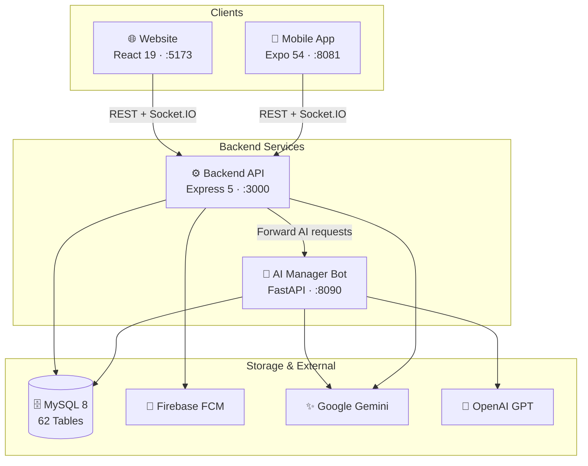

<div align="center">

# 🗺️ Travel Check-in

### Multi-role Travel Management & Experience System with AI Integration

*A comprehensive full-stack travel ecosystem connecting tourists with service providers through integrated POS, PMS, Smart QR Check-in, and AI-powered features.*

[](https://nodejs.org)
[](https://react.dev)
[](https://typescriptlang.org)
[](https://expo.dev)
[](https://python.org)
[](https://mysql.com)
[](https://expressjs.com)
[](https://socket.io)
[](https://firebase.google.com)
[](.)<br>
[](.)<br>

🇻🇳 [Phiên bản Tiếng Việt](./docs/README_VI.md)

</div>

---

## ✨ Highlights

<div align="center">

| 🗄️ 62 Tables | 🔌 16 Controllers | 🌐 59+ API Routes | 📱 4 Platforms |
|:---:|:---:|:---:|:---:|
| **59 Web Pages** | **6 Dev Phases** | **2 AI Engines** | **4 User Roles** |

</div>

---

## Table of Contents

- [Overview](#i-overview)
- [System Architecture](#ii-system-architecture)
- [Features by Role](#iii-features-by-role)
- [Tech Stack](#iv-tech-stack)
- [Database Schema](#v-database-schema--62-tables)
- [Project Structure](#vi-project-structure)
- [Getting Started](#vii-getting-started)
- [Development Progress](#viii-development-progress)

---

## I. Overview

Travel Check-in is a **multi-role full-stack platform** with four tightly integrated components:

| Component | Description | Stack |
|-----------|-------------|-------|
| **[Website Dashboard](./website/README.md)** | Admin · Owner · User management panels | React 19, Vite 7, Ant Design 6 |
| **[Backend API](./backend/README.md)** | RESTful API, real-time engine, business logic | Express 5, Node.js, MySQL |
| **[AI Manager Bot](./ai-manager-bot/README.md)** | Intelligent assistant for Admin & Owner | Python, FastAPI, Gemini, GPT |
| **[Mobile App](./mobile/README.md)** | Tourist experience & check-in app | Expo SDK 54, React Native |

---

## II. System Architecture



### Role-Based Access Control

| Role | Scope | Access |
|------|-------|--------|
| **Admin** | Platform-wide | Accounts, location moderation, commissions, SOS, settings, reports |
| **Owner** | Business-level | POS/PMS, services, employees, vouchers, commission settlement |
| **Employee** | Location-level | Front-office only: tables, hotel check-in/out, ticket scanning |
| **User / Tourist** | Consumer | Booking, QR wallet, check-in, diary, itinerary, SOS, AI chat |

---

## III. Features by Role

<details>
<summary><strong>🧳 User / Tourist</strong> — available on Web & Mobile</summary>

- **Dashboard** — Location recommendations + real-time weather widget
- **Interactive Map** — Split-screen map with weather overlay, routing & free location selection
- **Booking System** — Three independent booking UIs:
  - 🍽️ **Restaurants** — Table selection, party size, date/time
  - 🏨 **Hotels** — Room selection, check-in/check-out dates
  - 🎡 **Tourist Tickets** — Ticket type & quantity. Payment: Pay Later or VietQR Bank Transfer
- **QR Ticket Wallet** — Smart wallet with invoices, ticket codes, and dynamic QR codes for staff verification
- **Saved Locations** · **Travel Diary** · **Itinerary Planner** · **SOS Alert** (instant GPS to Admin)
- **AI Chat** — Google Gemini for recommendations & travel assistance
- **Profile** — Advanced Zalo-style avatar cropping & zooming

</details>

<details>
<summary><strong>👑 Admin</strong> — platform-wide control</summary>

- Platform analytics dashboard & KPI tracking
- Account management (lock/suspend all roles)
- Location & service moderation (approve/reject Owner submissions)
- Commission management & bank configuration (auto-generates VietQR for owners)
- Excel report exports (per-owner or platform-wide)
- System-wide vouchers, SOS real-time management, Push notification broadcasts

</details>

<details>
<summary><strong>🏢 Owner</strong> — two operation modes</summary>

**Normal Mode (Business Management)**
Dashboard, Location registration via map picker, Layout setup (drag-and-drop tables / hotel rooms / ticket types), Service management, Booking processing, Payment history, Vouchers, Commission settlement (VietQR), Employee management, Reviews & replies, Excel reports

**Operational Mode (POS/PMS)**
- 🍽️ **Restaurant POS** — Area & table management, order entry, invoice generation, QR/code check-in verification
- 🏨 **Hotel PMS** — Room availability dashboard, guest check-in/out, minibar charges, payment summary
- 🎡 **Tourism POS** — Offline ticket sales + digital QR/code scanning

</details>

<details>
<summary><strong>👷 Employee</strong> — restricted front-office access</summary>

Restricted to **Operational Mode** for their assigned location only. Handles table assignments, hotel check-in/out, and ticket scanning.

</details>

---

## IV. Tech Stack

<details>
<summary><strong>Backend</strong></summary>

| Category | Technology |
|----------|------------|
| Runtime | Node.js + TypeScript |
| Framework | Express 5.x |
| Database | MySQL 8 (mysql2 promise pool) |
| Authentication | JWT + bcrypt · OAuth (Google, Facebook) |
| Real-time | Socket.IO + Server-Sent Events (SSE) |
| Push Notifications | Firebase Cloud Messaging (firebase-admin) |
| AI (User) | Google Gemini (`@google/genai`) |
| File Processing | Multer (upload) + Sharp (resize/compress) |
| Scheduling | node-cron (auto-cancel, reminders) |
| Validation | Zod |
| Email | Nodemailer |

</details>

<details>
<summary><strong>Website Dashboard</strong></summary>

| Category | Technology |
|----------|------------|
| Framework | React 19 + Vite 7 |
| Language | TypeScript |
| UI Library | Ant Design 6 |
| Routing | React Router DOM v7 |
| State | Zustand + React Context |
| Maps | React Leaflet + Google Maps API |
| Charts | Recharts |
| Calendar | React Big Calendar |
| Real-time | Socket.IO Client |
| QR | qrcode.react (generate) + @zxing/browser (scan) |
| Export | ExcelJS |
| Forms | React Hook Form + Zod |

</details>

<details>
<summary><strong>AI Manager Bot</strong></summary>

| Category | Technology |
|----------|------------|
| Language | Python 3.x |
| Framework | FastAPI + Uvicorn |
| LLM | Google Gemini + OpenAI GPT (fallback) |
| NLP | Custom Vietnamese NLP + rule-based fallback |
| Database | MySQL (direct context queries) |
| Port | 8090 |

</details>

<details>
<summary><strong>Mobile App</strong></summary>

| Category | Technology |
|----------|------------|
| Framework | Expo SDK 54 + React Native 0.81.5 |
| Language | TypeScript |
| Navigation | Expo Router (file-based) |
| Styling | NativeWind (TailwindCSS for RN) |
| Maps | React Native Maps |
| State | Zustand |
| Forms | React Hook Form + Zod |
| Real-time | Socket.IO Client |
| Secure Storage | expo-secure-store |
| Location | expo-location (GPS) |

</details>

---

## V. Database Schema — 62 Tables

> 📄 Full SQL schema with FK constraints & indexes: `TravelCheckinApp.sql`

<details>
<summary><strong>View all 12 domains</strong></summary>

| # | Domain | Tables | Key Tables |
|---|--------|:------:|------------|
| 1 | Authentication & Users | 8 | `users`, `owner_profiles`, `user_active_sessions`, `login_history` |
| 2 | Locations & Services | 3 | `locations`, `services`, `service_categories` |
| 3 | Bookings & Payments | 7 | `bookings`, `booking_tickets`, `payments`, `commissions` |
| 4 | Hotel PMS | 4 | `hotel_rooms`, `hotel_guests`, `hotel_stays`, `hotel_stay_items` |
| 5 | Restaurant POS | 6 | `pos_areas`, `pos_tables`, `pos_orders`, `pos_order_items` |
| 6 | Check-in & SOS | 2 | `checkins`, `sos_alerts` |
| 7 | Reviews & Reports | 4 | `reviews`, `review_replies`, `reports`, `owner_violations` |
| 8 | Voucher System | 5 | `vouchers`, `voucher_locations`, `user_voucher_wallet` |
| 9 | Chat & Notifications | 6 | `chat_messages`, `location_chat_messages`, `push_notifications` |
| 10 | Image Storage | 3 | `images` (LONGBLOB), `entity_images`, `image_categories` |
| 11 | Itinerary | 2 | `itineraries`, `itinerary_items` |
| 12 | System & Utilities | 12 | `audit_logs`, `system_settings`, `ai_chat_history`, `ai_action_runs` |

</details>

---

## VI. Project Structure

```
TravelCheckinApp/
├── website/            # React 19 + Vite 7 + Ant Design 6   → website/README.md
├── backend/            # Node.js + Express 5 + TypeScript    → backend/README.md
├── ai-manager-bot/     # Python + FastAPI AI microservice    → ai-manager-bot/README.md
├── mobile/             # Expo SDK 54 + React Native          → mobile/README.md
├── docs/               # Documentation & Vietnamese README
└── TravelCheckinApp.sql # Complete database schema (62 tables)
```

---

## VII. Getting Started

### Prerequisites
```
Node.js >= 18    Python >= 3.10    MySQL >= 8.0    Expo CLI
```

### Setup

```bash
# 1. Database
mysql -u root -p < TravelCheckinApp.sql

# 2. Backend (AI Bot auto-starts on port 8090)
cd backend && cp .env.example .env && npm install && npm run dev

# 3. Website → http://localhost:5173
cd website && cp .env.example .env && npm install && npm run dev

# 4. Mobile → scan QR with Expo Go
cd mobile && cp .env.example .env && npm install && npm start
```

> 💡 See each component's `README.md` for full `.env` variable reference.

---

## VIII. Development Progress

### ✅ All 6 Phases Complete — Finalized July 2026

| Phase | Description | Status |
|:-----:|-------------|:------:|
| **1** | Database Schema + Core Backend API (Auth, RBAC, Middleware) | ✅ |
| **2** | Website Dashboard — Admin & Owner modules | ✅ |
| **3** | Full DB Schema (62 tables) + Complete business logic | ✅ |
| **4** | Mobile App — Auth, Home, Map, Booking & QR Wallet | ✅ |
| **5** | Mobile App — Saved Locations, Diary, SOS & Vouchers | ✅ |
| **6** | Mobile App — AI Chat, Location Chat & Itinerary Planner | ✅ |

| Module | Progress | Scope |
|--------|:--------:|-------|
| Backend API | ✅ 100% | 16 controllers · 15 route groups · real-time · cron |
| Website — Admin | ✅ 100% | 18 pages |
| Website — Owner | ✅ 100% | 21 pages |
| Website — User | ✅ 100% | 20 pages |
| Mobile App | ✅ 100% | Maps · check-in · QR wallet · SOS · AI chat · itinerary |
| AI Manager Bot | ✅ 100% | Intent classification · action planning · Gemini + GPT |
| Database | ✅ 100% | 62 tables · 12 domains |

---

<div align="center">

**Third-Party:** Node.js · Express · React · Ant Design · NativeWind · Socket.IO · MySQL · Expo · React Native · Google Gemini · OpenAI · Firebase · Leaflet · OpenStreetMap · VietQR · ExcelJS

*Last updated: July 30, 2026*

</div>
