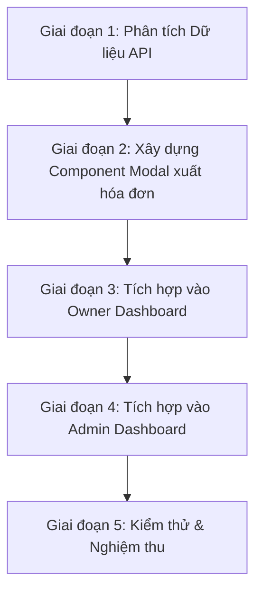

# Kế hoạch chi tiết: Chức năng Xuất hóa đơn lẻ và Báo cáo tổng hợp (PDF & Excel)

Tài liệu này mô tả chi tiết kế hoạch thiết kế, phạm vi điều chỉnh, cấu trúc mã nguồn và cách vận hành tính năng xuất hóa đơn tại trang quản trị **Admin** và đối tác **Owner** trên hệ thống website TravelCheckinApp.

> **Cập nhật:** 17/06/2026 — Sửa đổi sau audit: dùng `exceljs` thay HTML→.xls, dùng `react-to-print` thay `window.print()`, thêm error handling, validation, `formatMoney`.
> **Cập nhật:** 17/06/2026 — Thêm bộ lọc theo Owner/Location, xử lý Pagination, xử lý Timezone.

---

## 1. Phạm vi & Yêu cầu nghiệp vụ

Chức năng xuất hóa đơn sẽ được đặt tại Dashboard của Admin và Owner, hỗ trợ 2 chế độ xuất file chính:

### A. Xuất hóa đơn chi tiết (Đơn lẻ)
* **Mục tiêu:** Xuất chứng từ thanh toán cho một giao dịch cụ thể để in ấn hoặc gửi cho khách hàng.
* **Định dạng file hỗ trợ:**
  * **PDF:** Tạo bản in hóa đơn chuẩn khổ giấy A4/A5, sử dụng `react-to-print` để đảm bảo layout nhất quán cross-browser.
  * **Excel (.xlsx):** File Excel chuẩn tạo bằng thư viện `exceljs`, có định dạng ô, viền, in đậm tiêu đề và chữ ký người làm ở góc phải dưới cùng.
* **Cơ cấu hiển thị:**
  * Lấy nhãn hiển thị theo tiếng Việt thân thiện của website thay vì tên trường database (ví dụ: "Khách hàng" thay vì `booked_full_name`).
  * Hiển thị bảng dịch vụ dạng lưới có **Số thứ tự (STT)**, Tên dịch vụ chính, danh sách dịch vụ đi kèm/món ăn (nếu có), đơn giá, số lượng và thành tiền.
  * Phần chân trang (Footer) hiển thị khối **Ký tên của người lập hóa đơn** (lấy tự động từ tài khoản đăng nhập).

### B. Xuất báo cáo tổng hợp (Theo đợt/Nhiều dịch vụ)
* **Mục tiêu:** Tổng hợp danh sách các hóa đơn đã thanh toán để đối soát doanh thu.
* **Bộ lọc tùy chọn linh hoạt:**
  * **Thời gian:** Cho phép chọn từ ngày - đến ngày tùy ý.
  * **Dịch vụ:** Tích chọn **1 loại**, **nhiều loại**, hoặc **tất cả** loại dịch vụ (Nhà hàng/Cafe, Khách sạn/Resort, Vé tham quan/Du lịch).
  * **Địa điểm / Owner:** Xem chi tiết bên dưới.
* **Định dạng file:** Xuất ra file Excel (.xlsx) chuẩn tạo bằng `exceljs`, trình bày dạng bảng danh sách hóa đơn, tự động cộng tổng doanh thu ở dòng cuối và có chữ ký người làm báo cáo.
* **Giới hạn:** Tối đa 5000 dòng mỗi file. Nếu vượt quá, thông báo cho người dùng thu hẹp bộ lọc thời gian.

#### Bộ lọc theo vai trò (Owner vs Admin)

**Owner:**
* Chỉ thấy dữ liệu của các địa điểm thuộc quyền sở hữu của mình.
* Bộ lọc địa điểm: chọn **1 địa điểm** hoặc **Tất cả địa điểm** (dropdown đơn chọn, không multi-select).
* Flow: Chọn thời gian → Chọn địa điểm (1 hoặc tất cả) → Chọn loại dịch vụ → Xuất file.

**Admin:**
* Thấy toàn bộ dữ liệu hệ thống.
* Bộ lọc Owner: chọn **1 Owner** hoặc **Tất cả Owner** (dropdown đơn chọn, không multi-select).
* Khi chọn 1 Owner → hiện thêm dropdown địa điểm của Owner đó: chọn **1 địa điểm** hoặc **Tất cả địa điểm**.
* Khi chọn "Tất cả Owner" → ẩn dropdown địa điểm (xuất toàn bộ hệ thống).
* Flow: Chọn thời gian → Chọn Owner (1 hoặc tất cả) → [Nếu chọn 1 Owner] Chọn địa điểm (1 hoặc tất cả) → Chọn loại dịch vụ → Xuất file.

```
[Admin Modal Layout]

Thời gian:  [Từ ngày] — [Đến ngày]    ← RangePicker
Owner:      [Select: Tất cả Owner ▼]  ← Dropdown đơn chọn
Địa điểm:   [Select: Tất cả ▼]        ← Chỉ hiện khi chọn 1 Owner
Dịch vụ:    [☑ Nhà hàng] [☑ Khách sạn] [☑ Du lịch]  ← Checkbox nhóm
───
Kết quả: 123 hóa đơn | Tổng: 1.234.567 VND
[  Tải báo cáo Excel  ]
```

```
[Owner Modal Layout]

Thời gian:  [Từ ngày] — [Đến ngày]    ← RangePicker
Địa điểm:   [Select: Tất cả ▼]        ← Dropdown đơn chọn (chỉ hiện địa điểm của mình)
Dịch vụ:    [☑ Nhà hàng] [☑ Khách sạn] [☑ Du lịch]  ← Checkbox nhóm
───
Kết quả: 45 hóa đơn | Tổng: 567.890 VND
[  Tải báo cáo Excel  ]
```

---

## 2. Dependencies cần cài thêm

```bash
# Website
cd website
npm install exceljs react-to-print
npm install -D @types/exceljs
```

| Thư viện | Phiên bản | Mục đích |
|----------|-----------|----------|
| `exceljs` | ^4.4.0 | Tạo file .xlsx chuẩn, hỗ trợ styling, formula, auto-width columns |
| `react-to-print` | ^3.0.0 | In component React trực tiếp, control layout tốt hơn `window.print()` |

---

## 3. Các giai đoạn triển khai (Phases)



### Giai đoạn 1: Phân tích & Tận dụng API Backend có sẵn
Hệ thống hiện tại đã có đầy đủ các API trả về danh sách lịch sử giao dịch:
* **Admin:** API `adminApi.getHistoryInvoices()` trả về toàn bộ danh sách giao dịch kèm thông tin địa điểm, dịch vụ, khách hàng.
* **Owner:** API `ownerApi.getPayments({ status: 'completed' })` trả về các giao dịch thanh toán thành công của các địa điểm thuộc quyền sở hữu của Owner đó.
* **Chi tiết món ăn (POS Restaurant):** API `ownerApi.getBookingFoodItems(bookingId)` trả về danh sách các món ăn gọi tại bàn của hóa đơn đó.

**Hướng chỉnh sửa:** Chúng ta sẽ gọi các API này để lấy danh sách giao dịch, sau đó thực hiện lọc và định dạng trực tiếp tại Client-side (Frontend) để tối ưu hiệu năng và không cần tạo thêm các API xuất file phức tạp ở Backend.

---

### Giai đoạn 2: Xây dựng Component `InvoiceExportModal.tsx`
* **Vị trí file:** `website/src/components/InvoiceExportModal.tsx` [NEW]
* **Mô tả logic chính:**
  * Sử dụng `<Modal>` của Ant Design, chứa 2 Tab: `"Xuất hóa đơn lẻ"` và `"Xuất báo cáo tổng hợp"`.
  * **Tab Xuất hóa đơn lẻ:**
    * Chứa ô `<Select showSearch>` để người dùng tìm kiếm nhanh hóa đơn theo Mã HĐ, Tên khách hoặc Địa điểm.
    * Khi chọn hóa đơn, gọi API lấy chi tiết món ăn (nếu loại dịch vụ là `restaurant` hoặc `cafe`).
    * Hiển thị bảng xem trước (Preview) hóa đơn có cột STT và phần Ký tên.
    * Nút **In / Tải PDF** sử dụng `react-to-print` để in component Preview trực tiếp.
    * Nút **Tải Excel** dùng `exceljs` tạo file .xlsx chuẩn với styling.
  * **Tab Xuất báo cáo tổng hợp:**
    * Chứa bộ chọn ngày `RangePicker` và nhóm `Checkbox` chọn loại dịch vụ (`restaurant`, `hotel`, `tourist`).
    * **Nếu `role="owner"`:** Hiện dropdown chọn địa điểm (1 hoặc tất cả) — chỉ hiện các địa điểm thuộc Owner.
    * **Nếu `role="admin"`:** Hiện dropdown chọn Owner (1 hoặc tất cả). Khi chọn 1 Owner → hiện thêm dropdown địa điểm (1 hoặc tất cả).
    * Lọc danh sách hóa đơn thỏa mãn điều kiện và tạo file Excel chứa bảng tổng hợp doanh số.
    * Hiển thị số lượng kết quả lọc trước khi xuất.

---

### Giai đoạn 3: Tích hợp vào Owner Dashboard (`OwnerDashboard.tsx`)
* **Vị trí file:** `website/src/pages/Owner/OwnerDashboard.tsx` [MODIFY]
* **Hướng chỉnh sửa:**
  * Import `InvoiceExportModal` và khai báo state `isInvoiceModalOpen`.
  * Thêm nút bấm **"Xuất hóa đơn lẻ & Báo cáo"** vào thanh công cụ quản trị.
  * Render Modal ở cuối trang, truyền props:
    * `role="owner"`
    * `currentUserName={ownerName}`
    * `locations={ownerLocations}` — danh sách địa điểm của Owner (để populate dropdown)
    * `invoices={ownerInvoices}` — dữ liệu từ `ownerApi.getPayments({ status: 'completed' })`

---

### Giai đoạn 4: Tích hợp vào Admin Dashboard (`Dashboard.tsx`)
* **Vị trí file:** `website/src/pages/Admin/Dashboard.tsx` [MODIFY]
* **Hướng chỉnh sửa:**
  * Import `InvoiceExportModal` và khai báo state `isInvoiceModalOpen`.
  * Thêm nút bấm **"Xuất hóa đơn lẻ & Báo cáo"** cạnh bộ lọc ngày.
  * Render Modal ở cuối trang, truyền props:
    * `role="admin"`
    * `currentUserName={user.full_name}`
    * `owners={allOwners}` — danh sách Owner (để populate dropdown)
    * `invoices={allInvoices}` — dữ liệu từ `adminApi.getHistoryInvoices()`

---

## 4. Bản thảo cấu trúc mã nguồn (Code Templates)

### A. Utility: `formatMoney`

```typescript
// website/src/utils/formatMoney.ts
/**
 * Format số tiền VND: 1000000 → "1.000.000"
 */
export const formatMoney = (amount: number | string | null | undefined): string => {
  const num = typeof amount === "string" ? Number(amount) : amount;
  if (num == null || isNaN(num)) return "0";
  return num.toLocaleString("vi-VN");
};
```

---

### B. Hàm xuất báo cáo tổng hợp Excel bằng `exceljs`

```typescript
// website/src/utils/exportExcel.ts
import ExcelJS from "exceljs";
import dayjs from "dayjs";
import { formatMoney } from "./formatMoney";

interface InvoiceData {
  payment_id: number;
  booked_full_name?: string;
  user_full_name?: string;
  location_name: string;
  booking_service_name?: string;
  booking_service_type?: string;
  payment_time: string;
  payment_method?: string;
  amount: number | string;
}

export const handleExportBatchExcel = async (
  filteredInvoices: InvoiceData[],
  selectedTypes: string[],
  dateRange: [dayjs.Dayjs, dayjs.Dayjs],
  currentUserName: string
) => {
  // 1. Validate dữ liệu
  const data = filteredInvoices.filter((inv) => {
    const type = inv.booking_service_type || "other";
    if (selectedTypes.includes("restaurant") && (type === "restaurant" || type === "cafe")) return true;
    if (selectedTypes.includes("hotel") && (type === "hotel" || type === "resort")) return true;
    if (selectedTypes.includes("tourist") && type === "tourist") return true;
    return false;
  });

  if (data.length === 0) {
    throw new Error("Không có dữ liệu phù hợp với bộ lọc dịch vụ!");
  }

  if (data.length > 5000) {
    throw new Error(`Dữ liệu quá lớn (${data.length} dòng). Vui lòng thu hẹp bộ lọc thời gian.`);
  }

  // 2. Tạo workbook
  const workbook = new ExcelJS.Workbook();
  workbook.creator = currentUserName;
  workbook.created = new Date();

  const sheet = workbook.addWorksheet("Báo cáo doanh thu");

  // 3. Styles
  const headerStyle: Partial<ExcelJS.Style> = {
    font: { bold: true, size: 11 },
    fill: { type: "pattern", pattern: "solid", fgColor: { argb: "FFF1F5F9" } },
    border: {
      top: { style: "thin" },
      bottom: { style: "thin" },
      left: { style: "thin" },
      right: { style: "thin" },
    },
    alignment: { horizontal: "center", vertical: "middle" },
  };

  const cellBorder: Partial<ExcelJS.Border> = {
    top: { style: "thin" },
    bottom: { style: "thin" },
    left: { style: "thin" },
    right: { style: "thin" },
  };

  // 4. Title rows
  sheet.mergeCells("A1:H1");
  const titleCell = sheet.getCell("A1");
  titleCell.value = "BÁO CÁO DOANH THU TỔNG HỢP GIAO DỊCH";
  titleCell.font = { bold: true, size: 14 };
  titleCell.alignment = { horizontal: "center" };

  sheet.mergeCells("A2:H2");
  const subtitleCell = sheet.getCell("A2");
  subtitleCell.value = `Khoảng thời gian: từ ${dateRange[0].format("DD/MM/YYYY")} đến ${dateRange[1].format("DD/MM/YYYY")}`;
  subtitleCell.alignment = { horizontal: "center" };

  // 5. Headers
  const headers = ["STT", "Mã HĐ", "Khách Hàng", "Địa Điểm", "Dịch Vụ", "Thời Gian", "Phương Thức", "Doanh Thu (VND)"];
  const headerRow = sheet.addRow(headers);
  headerRow.eachCell((cell) => {
    Object.assign(cell, { style: headerStyle });
    cell.border = cellBorder;
  });

  // 6. Data rows
  data.forEach((inv, index) => {
    const row = sheet.addRow([
      index + 1,
      `HD${inv.payment_id}`,
      inv.booked_full_name || inv.user_full_name || "Khách vãng lai",
      inv.location_name,
      inv.booking_service_name || "Check-in",
      dayjs(inv.payment_time).format("DD/MM/YYYY HH:mm"),
      inv.payment_method === "cash" ? "Tiền mặt" : "Chuyển khoản",
      Number(inv.amount || 0),
    ]);
    row.eachCell((cell, colNumber) => {
      cell.border = cellBorder;
      if (colNumber === 8) {
        cell.numFmt = "#,##0";
        cell.alignment = { horizontal: "right" };
      }
    });
  });

  // 7. Total row
  const totalAmount = data.reduce((sum, item) => sum + Number(item.amount || 0), 0);
  const totalRow = sheet.addRow(["", "", "", "", "", "", "TỔNG CỘNG:", totalAmount]);
  totalRow.eachCell((cell, colNumber) => {
    cell.font = { bold: true };
    cell.border = cellBorder;
    if (colNumber === 7) cell.alignment = { horizontal: "right" };
    if (colNumber === 8) {
      cell.numFmt = "#,##0";
      cell.font = { bold: true, color: { argb: "FFFF0000" } };
      cell.alignment = { horizontal: "right" };
    }
  });

  // 8. Signature
  sheet.addRow([]);
  sheet.addRow([]);
  const sigRow1 = sheet.addRow(["", "", "", "", "", "Người lập báo cáo"]);
  sigRow1.getCell(6).font = { bold: true };
  sigRow1.getCell(6).alignment = { horizontal: "center" };

  const sigRow2 = sheet.addRow(["", "", "", "", "", "(Ký, ghi rõ họ tên)"]);
  sigRow2.getCell(6).font = { italic: true, color: { argb: "FF94A3B8" } };
  sigRow2.getCell(6).alignment = { horizontal: "center" };

  sheet.addRow([]);
  const nameRow = sheet.addRow(["", "", "", "", "", currentUserName]);
  nameRow.getCell(6).font = { bold: true };
  nameRow.getCell(6).alignment = { horizontal: "center" };

  // 9. Auto-width columns
  sheet.columns.forEach((column) => {
    let maxLength = 10;
    column.eachCell?.({ includeEmpty: false }, (cell) => {
      const len = cell.value?.toString().length || 0;
      if (len > maxLength) maxLength = len;
    });
    column.width = Math.min(maxLength + 4, 40);
  });

  // 10. Download
  const buffer = await workbook.xlsx.writeBuffer();
  const blob = new Blob([buffer], {
    type: "application/vnd.openxmlformats-officedocument.spreadsheetml.sheet",
  });
  const url = URL.createObjectURL(blob);
  const link = document.createElement("a");
  link.href = url;
  link.download = `Bao_cao_doanh_thu_${dayjs().format("YYYYMMDD_HHmmss")}.xlsx`;
  document.body.appendChild(link);
  link.click();
  document.body.removeChild(link);
  URL.revokeObjectURL(url);
};
```

---

### C. Hàm xuất hóa đơn đơn lẻ Excel bằng `exceljs`

```typescript
// website/src/utils/exportInvoiceExcel.ts
import ExcelJS from "exceljs";
import dayjs from "dayjs";
import { formatMoney } from "./formatMoney";

interface InvoiceDetail {
  payment_id: number;
  booked_full_name?: string;
  user_full_name?: string;
  phone?: string;
  location_name: string;
  location_address?: string;
  booking_service_name?: string;
  booking_service_type?: string;
  payment_time: string;
  payment_method?: string;
  amount: number | string;
  check_in_date?: string;
  check_out_date?: string;
  contact_name?: string;
  contact_phone?: string;
  food_items?: Array<{ name: string; quantity: number; price: number }>;
}

export const exportInvoiceExcel = async (invoice: InvoiceDetail, currentUserName: string) => {
  const workbook = new ExcelJS.Workbook();
  const sheet = workbook.addWorksheet("Hóa đơn");

  // Column widths
  sheet.columns = [
    { width: 8 },   // STT
    { width: 30 },  // Tên dịch vụ
    { width: 15 },  // Đơn giá
    { width: 10 },  // SL
    { width: 18 },  // Thành tiền
  ];

  const cellBorder: Partial<ExcelJS.Border> = {
    top: { style: "thin" },
    bottom: { style: "thin" },
    left: { style: "thin" },
    right: { style: "thin" },
  };

  // Title
  sheet.mergeCells("A1:E1");
  const title = sheet.getCell("A1");
  title.value = "HÓA ĐƠN THANH TOÁN";
  title.font = { bold: true, size: 16 };
  title.alignment = { horizontal: "center" };

  // Invoice info
  let row = 3;
  const addInfo = (label: string, value: string) => {
    sheet.getCell(`A${row}`).value = label;
    sheet.getCell(`A${row}`).font = { bold: true };
    sheet.getCell(`B${row}`).value = value;
    row++;
  };

  addInfo("Mã hóa đơn:", `HD${invoice.payment_id}`);
  addInfo("Khách hàng:", invoice.booked_full_name || invoice.user_full_name || "Khách vãng lai");
  if (invoice.phone) addInfo("Điện thoại:", invoice.phone);
  addInfo("Địa điểm:", invoice.location_name);
  if (invoice.location_address) addInfo("Địa chỉ:", invoice.location_address);
  addInfo("Dịch vụ:", invoice.booking_service_name || "Check-in");
  addInfo("Thời gian:", dayjs(invoice.payment_time).format("DD/MM/YYYY HH:mm"));
  addInfo("Phương thức:", invoice.payment_method === "cash" ? "Tiền mặt" : "Chuyển khoản");
  if (invoice.check_in_date) addInfo("Ngày nhận:", dayjs(invoice.check_in_date).format("DD/MM/YYYY"));
  if (invoice.check_out_date) addInfo("Ngày trả:", dayjs(invoice.check_out_date).format("DD/MM/YYYY"));

  row++;

  // Items table header
  const headers = ["STT", "Tên dịch vụ / Món ăn", "Đơn giá", "SL", "Thành tiền"];
  const headerRow = sheet.addRow(headers);
  headerRow.eachCell((cell) => {
    cell.font = { bold: true };
    cell.fill = { type: "pattern", pattern: "solid", fgColor: { argb: "FFF1F5F9" } };
    cell.border = cellBorder;
    cell.alignment = { horizontal: "center" };
  });

  // Main service row
  const mainRow = sheet.addRow([
    1,
    invoice.booking_service_name || "Check-in",
    Number(invoice.amount || 0),
    1,
    Number(invoice.amount || 0),
  ]);
  mainRow.eachCell((cell, col) => {
    cell.border = cellBorder;
    if (col >= 3) {
      cell.numFmt = "#,##0";
      cell.alignment = { horizontal: "right" };
    }
  });

  // Food items (if any)
  if (invoice.food_items && invoice.food_items.length > 0) {
    invoice.food_items.forEach((item, idx) => {
      const foodRow = sheet.addRow([
        idx + 2,
        item.name,
        item.price,
        item.quantity,
        item.price * item.quantity,
      ]);
      foodRow.eachCell((cell, col) => {
        cell.border = cellBorder;
        if (col >= 3) {
          cell.numFmt = "#,##0";
          cell.alignment = { horizontal: "right" };
        }
      });
    });
  }

  // Total
  const totalRow = sheet.addRow(["", "", "", "TỔNG:", Number(invoice.amount || 0)]);
  totalRow.eachCell((cell, col) => {
    cell.font = { bold: true };
    cell.border = cellBorder;
    if (col === 4) cell.alignment = { horizontal: "right" };
    if (col === 5) {
      cell.numFmt = "#,##0";
      cell.font = { bold: true, color: { argb: "FFFF0000" } };
      cell.alignment = { horizontal: "right" };
    }
  });

  // Signature
  row = sheet.rowCount + 2;
  sheet.getCell(`D${row}`).value = "Người lập hóa đơn";
  sheet.getCell(`D${row}`).font = { bold: true };
  sheet.getCell(`D${row}`).alignment = { horizontal: "center" };
  sheet.mergeCells(`D${row}:E${row}`);

  row++;
  sheet.getCell(`D${row}`).value = "(Ký, ghi rõ họ tên)";
  sheet.getCell(`D${row}`).font = { italic: true, color: { argb: "FF94A3B8" } };
  sheet.getCell(`D${row}`).alignment = { horizontal: "center" };
  sheet.mergeCells(`D${row}:E${row}`);

  row += 2;
  sheet.getCell(`D${row}`).value = currentUserName;
  sheet.getCell(`D${row}`).font = { bold: true };
  sheet.getCell(`D${row}`).alignment = { horizontal: "center" };
  sheet.mergeCells(`D${row}:E${row}`);

  // Download
  const buffer = await workbook.xlsx.writeBuffer();
  const blob = new Blob([buffer], {
    type: "application/vnd.openxmlformats-officedocument.spreadsheetml.sheet",
  });
  const url = URL.createObjectURL(blob);
  const link = document.createElement("a");
  link.href = url;
  link.download = `Hoa_don_HD${invoice.payment_id}_${dayjs().format("YYYYMMDD")}.xlsx`;
  document.body.appendChild(link);
  link.click();
  document.body.removeChild(link);
  URL.revokeObjectURL(url);
};
```

---

### D. Component In hóa đơn (PDF) bằng `react-to-print`

```tsx
// website/src/components/InvoicePrintTemplate.tsx
import React, { forwardRef } from "react";
import dayjs from "dayjs";
import { formatMoney } from "../utils/formatMoney";

interface InvoicePrintProps {
  invoice: {
    payment_id: number;
    booked_full_name?: string;
    user_full_name?: string;
    phone?: string;
    location_name: string;
    location_address?: string;
    booking_service_name?: string;
    booking_service_type?: string;
    payment_time: string;
    payment_method?: string;
    amount: number | string;
    check_in_date?: string;
    check_out_date?: string;
    food_items?: Array<{ name: string; quantity: number; price: number }>;
  };
  currentUserName: string;
}

const InvoicePrintTemplate = forwardRef<HTMLDivElement, InvoicePrintProps>(
  ({ invoice, currentUserName }, ref) => {
    return (
      <div
        ref={ref}
        style={{
          padding: 40,
          fontFamily: "'Times New Roman', Times, serif",
          maxWidth: 800,
          margin: "0 auto",
        }}
      >
        <h1 style={{ textAlign: "center", fontSize: 20, marginBottom: 4 }}>
          HÓA ĐƠN THANH TOÁN
        </h1>
        <p style={{ textAlign: "center", color: "#666", marginBottom: 20 }}>
          Mã hóa đơn: HD{invoice.payment_id}
        </p>

        <table style={{ width: "100%", marginBottom: 16, fontSize: 14 }}>
          <tbody>
            <tr>
              <td style={{ fontWeight: "bold", width: 140 }}>Khách hàng:</td>
              <td>{invoice.booked_full_name || invoice.user_full_name || "Khách vãng lai"}</td>
            </tr>
            {invoice.phone && (
              <tr>
                <td style={{ fontWeight: "bold" }}>Điện thoại:</td>
                <td>{invoice.phone}</td>
              </tr>
            )}
            <tr>
              <td style={{ fontWeight: "bold" }}>Địa điểm:</td>
              <td>
                {invoice.location_name}
                {invoice.location_address && ` — ${invoice.location_address}`}
              </td>
            </tr>
            <tr>
              <td style={{ fontWeight: "bold" }}>Dịch vụ:</td>
              <td>{invoice.booking_service_name || "Check-in"}</td>
            </tr>
            <tr>
              <td style={{ fontWeight: "bold" }}>Thời gian:</td>
              <td>{dayjs(invoice.payment_time).format("DD/MM/YYYY HH:mm")}</td>
            </tr>
            <tr>
              <td style={{ fontWeight: "bold" }}>Phương thức:</td>
              <td>{invoice.payment_method === "cash" ? "Tiền mặt" : "Chuyển khoản"}</td>
            </tr>
          </tbody>
        </table>

        <table
          style={{
            width: "100%",
            borderCollapse: "collapse",
            marginBottom: 16,
            fontSize: 14,
          }}
        >
          <thead>
            <tr style={{ backgroundColor: "#f1f5f9" }}>
              <th style={{ border: "1px solid #cbd5e1", padding: 8, width: 50 }}>STT</th>
              <th style={{ border: "1px solid #cbd5e1", padding: 8, textAlign: "left" }}>
                Tên dịch vụ / Món ăn
              </th>
              <th style={{ border: "1px solid #cbd5e1", padding: 8, width: 100 }}>Đơn giá</th>
              <th style={{ border: "1px solid #cbd5e1", padding: 8, width: 50 }}>SL</th>
              <th style={{ border: "1px solid #cbd5e1", padding: 8, width: 120 }}>Thành tiền</th>
            </tr>
          </thead>
          <tbody>
            <tr>
              <td style={{ border: "1px solid #cbd5e1", padding: 8, textAlign: "center" }}>1</td>
              <td style={{ border: "1px solid #cbd5e1", padding: 8 }}>
                {invoice.booking_service_name || "Check-in"}
              </td>
              <td style={{ border: "1px solid #cbd5e1", padding: 8, textAlign: "right" }}>
                {formatMoney(invoice.amount)}
              </td>
              <td style={{ border: "1px solid #cbd5e1", padding: 8, textAlign: "center" }}>1</td>
              <td style={{ border: "1px solid #cbd5e1", padding: 8, textAlign: "right" }}>
                {formatMoney(invoice.amount)}
              </td>
            </tr>
            {invoice.food_items?.map((item, idx) => (
              <tr key={idx}>
                <td style={{ border: "1px solid #cbd5e1", padding: 8, textAlign: "center" }}>
                  {idx + 2}
                </td>
                <td style={{ border: "1px solid #cbd5e1", padding: 8 }}>{item.name}</td>
                <td style={{ border: "1px solid #cbd5e1", padding: 8, textAlign: "right" }}>
                  {formatMoney(item.price)}
                </td>
                <td style={{ border: "1px solid #cbd5e1", padding: 8, textAlign: "center" }}>
                  {item.quantity}
                </td>
                <td style={{ border: "1px solid #cbd5e1", padding: 8, textAlign: "right" }}>
                  {formatMoney(item.price * item.quantity)}
                </td>
              </tr>
            ))}
            <tr style={{ backgroundColor: "#f1f5f9" }}>
              <td colSpan={4} style={{ border: "1px solid #cbd5e1", padding: 8, textAlign: "right", fontWeight: "bold" }}>
                TỔNG CỘNG:
              </td>
              <td
                style={{
                  border: "1px solid #cbd5e1",
                  padding: 8,
                  textAlign: "right",
                  fontWeight: "bold",
                  color: "red",
                }}
              >
                {formatMoney(invoice.amount)}
              </td>
            </tr>
          </tbody>
        </table>

        <div style={{ display: "flex", justifyContent: "flex-end", marginTop: 40 }}>
          <div style={{ textAlign: "center", width: 200 }}>
            <p style={{ fontWeight: "bold", marginBottom: 4 }}>Người lập hóa đơn</p>
            <p style={{ fontStyle: "italic", color: "#94a3b8", marginBottom: 40 }}>
              (Ký, ghi rõ họ tên)
            </p>
            <p style={{ fontWeight: "bold" }}>{currentUserName}</p>
          </div>
        </div>
      </div>
    );
  }
);

InvoicePrintTemplate.displayName = "InvoicePrintTemplate";
export default InvoicePrintTemplate;
```

---

### E. Sử dụng `react-to-print` trong Modal

```tsx
// Trong InvoiceExportModal.tsx
import { useReactToPrint } from "react-to-print";
import InvoicePrintTemplate from "./InvoicePrintTemplate";
import { useRef } from "react";

const printRef = useRef<HTMLDivElement>(null);

const handlePrint = useReactToPrint({
  contentRef: printRef,
  documentTitle: `Hoa_don_HD${selectedInvoice?.payment_id}`,
});

// JSX:
<div style={{ position: "absolute", left: "-9999px" }}>
  {selectedInvoice && (
    <InvoicePrintTemplate
      ref={printRef}
      invoice={selectedInvoice}
      currentUserName={currentUserName}
    />
  )}
</div>

<Button onClick={handlePrint}>In / Tải PDF</Button>
```

---

### F. Error handling pattern

```tsx
// Trong InvoiceExportModal.tsx
const [error, setError] = useState<string | null>(null);
const [loading, setLoading] = useState(false);

const handleExportBatch = async () => {
  setError(null);
  setLoading(true);
  try {
    await handleExportBatchExcel(filteredInvoices, selectedTypes, dateRange, currentUserName);
    message.success("Xuất báo cáo thành công!");
  } catch (err: any) {
    const msg = err?.message || "Có lỗi xảy ra khi xuất báo cáo";
    setError(msg);
    message.error(msg);
  } finally {
    setLoading(false);
  }
};

const handleExportSingle = async () => {
  if (!selectedInvoice) {
    message.warning("Vui lòng chọn hóa đơn trước!");
    return;
  }
  setError(null);
  setLoading(true);
  try {
    await exportInvoiceExcel(selectedInvoice, currentUserName);
    message.success("Xuất hóa đơn thành công!");
  } catch (err: any) {
    const msg = err?.message || "Có lỗi xảy ra khi xuất hóa đơn";
    setError(msg);
    message.error(msg);
  } finally {
    setLoading(false);
  }
};
```

---

## 5. Hướng dẫn Sử dụng & Vận hành

### Bước 1: Mở chức năng xuất hóa đơn
1. Đăng nhập vào trang quản trị (Admin hoặc Owner).
2. Tại màn hình Dashboard chính, tìm nút **"Xuất hóa đơn & Báo cáo"** ở góc trên cùng bên phải.
3. Click vào nút để hiển thị Modal tiện ích.

### Bước 2: Xuất hóa đơn đơn lẻ
1. Chọn tab **"Xuất hóa đơn lẻ"**.
2. Tìm hóa đơn trong danh sách (có thể gõ để tìm kiếm theo Mã HĐ, Tên khách hoặc Địa điểm).
3. Sau khi chọn, giao diện xem trước (Preview) hóa đơn sẽ xuất hiện hiển thị đầy đủ thông tin giao dịch, dịch vụ đi kèm và ô ký tên có sẵn tên của bạn.
4. Click **"Tải Excel"** để lưu file dạng `.xlsx`, hoặc click **"In / Tải PDF"** để mở giao diện in ấn của trình duyệt.

### Bước 3: Xuất báo cáo tổng hợp
1. Chọn tab **"Xuất báo cáo tổng hợp"**.
2. Chọn khoảng thời gian muốn báo cáo tại bộ chọn ngày.
3. **Nếu là Owner:**
   * Chọn địa điểm: 1 địa điểm cụ thể hoặc "Tất cả địa điểm".
4. **Nếu là Admin:**
   * Chọn Owner: 1 Owner cụ thể hoặc "Tất cả Owner".
   * Nếu chọn 1 Owner → hiện thêm dropdown địa điểm: 1 địa điểm hoặc "Tất cả địa điểm".
5. Tích chọn các loại dịch vụ cần tổng hợp (Nhà hàng, Khách sạn, Du lịch). Bạn có thể chọn tất cả hoặc chọn riêng một số mục.
6. Kiểm tra số lượng kết quả hiển thị ở dưới bộ lọc.
7. Click **"Tải báo cáo Excel"**. Hệ thống sẽ tự động lọc, cộng tổng doanh thu và xuất ra file Excel hoàn chỉnh có chữ ký lập biểu.

---

## 6. Rủi ro & Điểm cần lưu ý (Risks & Considerations)

### 6.1 Pagination của API Backend

**Rủi ro:** `adminApi.getHistoryInvoices()` và `ownerApi.getPayments()` có thể đang phân trang (mỗi lần chỉ trả 20-50 kết quả). Frontend không gom đủ dữ liệu để xuất file.

**Cách xử lý:**
* **Bước 1:** Kiểm tra 2 API này có hỗ trợ tham số `limit=all` hoặc `limit=99999` không.
* **Bước 2:** Nếu KHÔNG hỗ trợ → Backend cần viết thêm 1 endpoint mới cho export (không phân trang), ví dụ:
  * `GET /api/admin/export/invoices?from=...&to=...&ownerId=...&locationId=...`
  * `GET /api/owner/export/payments?from=...&to=...&locationId=...`
* **Bước 3:** Nếu có hỗ trợ → Frontend gọi với `limit=all` và xử lý như bình thường.

**Ưu tiên:** Cao — cần verify TRƯỚC khi bắt đầu code.

**Kết quả verify (18/06/2026):**
* Admin `getAdminHistoryInvoices`: hardcoded `LIMIT 1000` — không có pagination param
* Owner `getOwnerPayments`: hardcoded `LIMIT 200` — không có pagination param
* Cả 2 đủ cho export (giới hạn 5000 dòng trong plan). Không cần Backend endpoint mới.

---

### 6.2 Hiệu năng Client-side (Frontend heavy)

**Rủi ro:** Lấy 5000 dòng về trình duyệt + dùng `exceljs` sinh file → tốn RAM, lag trên máy yếu.

**Cách xử lý:**
* Giới hạn 5000 dòng mỗi file (đã có trong plan).
* Nếu vượt quá → thông báo người dùng thu hẹp bộ lọc thời gian.
* Đây là trade-off hợp lý: không cần viết logic xuất file ở Backend.
* **Tương lai:** Nếu hệ thống phình to (>10K hóa đơn/tháng) → chuyển export sang Backend.

---

### 6.3 Xuất PDF (react-to-print vs direct download)

**Rủi ro:** `react-to-print` mở hộp thoại in của trình duyệt, người dùng phải tự chọn "Save as PDF". Không phải bấm là tải .pdf ngay.

**Cách xử lý:**
* **Giải pháp hiện tại:** Dùng `react-to-print` — chấp nhận hộp thoại in. Giao diện đẹp, layout ổn định cross-browser.
* **Nếu cần direct download:** Phải dùng `jspdf` + `html2canvas` hoặc tạo PDF từ Backend. Nhưng file sẽ nặng hơn và layout có thể lệch.
* **Khuyến nghị:** Giữ `react-to-print`, ghi rõ trong hướng dẫn sử dụng "Chọn máy in ảo → Save as PDF".

---

### 6.4 Quản lý Timezone (Múi giờ)

**Rủi ro:** `payment_time` từ API có thể là UTC, nhưng trình duyệt hiển thị theo múi giờ local. Báo cáo bị lệch ngày khi khách ở múi giờ khác.

**Cách xử lý:**
* Toàn bộ hệ thống dùng **GMT+7 (Việt Nam)**.
* Khi format thời gian xuất file, luôn convert sang GMT+7:
  ```typescript
  import dayjs from "dayjs";
  import utc from "dayjs/plugin/utc";
  import timezone from "dayjs/plugin/timezone";
  dayjs.extend(utc);
  dayjs.extend(timezone);
  
  // Format thời gian luôn dùng GMT+7
  dayjs(payment_time).tz("Asia/Ho_Chi_Minh").format("DD/MM/YYYY HH:mm");
  ```
* Khi lọc theo ngày (RangePicker), cũng convert input sang GMT+7 trước khi so sánh.
* **Lưu ý:** Cần cài thêm `dayjs/plugin/utc` và `dayjs/plugin/timezone` (đã có sẵn trong `dayjs` bundle, chỉ cần extend).

---

### 6.5 Tổng hợp rủi ro

| # | Rủi ro | Mức độ | Đã có giải pháp | Cần làm trước khi code |
|---|--------|--------|-----------------|------------------------|
| 6.1 | API Pagination | Cao | ✅ | Verify API có limit=all không |
| 6.2 | Client-side performance | Trung bình | ✅ | Không (giới hạn 5000 dòng) |
| 6.3 | PDF không direct download | Thấp | ✅ | Không (giữ react-to-print) |
| 6.4 | Timezone lệch ngày | Trung bình | ✅ | Cài dayjs timezone plugin |

---

## 7. Checklist triển khai

> **Hướng dẫn:** Đánh dấu `[x]` khi hoàn thành, `[-]` khi đang làm, `[ ]` khi chưa bắt đầu.
> Ghi ngày hoàn thành vào cột "Xong" để dễ theo dõi.

### Giai đoạn 1: Chuẩn bị & Kiểm tra

| # | Việc cần làm | Mô tả | Ưu tiên | Trạng thái | Xong |
|---|--------------|-------|---------|------------|------|
| 1.1 | Cài dependencies | Chạy `cd website && npm install exceljs react-to-print` | Cao | [x] | 18/06/2026 |
| 1.2 | Verify API Pagination | Admin: LIMIT 1000, Owner: LIMIT 200 — không có param pagination, đủ cho export | Cao | [x] | 18/06/2026 |
| 1.3 | Verify API data fields | API trả đủ payment_id, location_name, amount, payment_time, booked_full_name | Cao | [x] | 18/06/2026 |
| 1.4 | Xác định cách xử lý Pagination | Không cần Backend mới — hardcoded limits (1000/200) đủ cho export | Cao | [x] | 18/06/2026 |

### Giai đoạn 2: Tạo utility functions

| # | Việc cần làm | Mô tả | Ưu tiên | Trạng thái | Xong |
|---|--------------|-------|---------|------------|------|
| 2.1 | Tạo `website/src/utils/formatMoney.ts` | Đã tồn tại sẵn (formatMoney + formatNumber) | Cao | [x] | 18/06/2026 |
| 2.2 | Tạo `website/src/utils/exportExcel.ts` | Hàm xuất báo cáo tổng hợp Excel bằng exceljs, có xử lý timezone GMT+7 | Cao | [x] | 18/06/2026 |
| 2.3 | Tạo `website/src/utils/exportInvoiceExcel.ts` | Hàm xuất hóa đơn đơn lẻ Excel bằng exceljs, có xử lý timezone GMT+7 | Cao | [x] | 18/06/2026 |

### Giai đoạn 3: Tạo components

| # | Việc cần làm | Mô tả | Ưu tiên | Trạng thái | Xong |
|---|--------------|-------|---------|------------|------|
| 3.1 | Tạo `website/src/components/InvoicePrintTemplate.tsx` | Component template hóa đơn để in PDF (dùng react-to-print) | Cao | [x] | 18/06/2026 |
| 3.2 | Tạo `website/src/components/InvoiceExportModal.tsx` | Modal chính chứa 2 tab: hóa đơn lẻ + báo cáo tổng hợp, có bộ lọc theo role (Owner/Admin) | Cao | [x] | 18/06/2026 |

### Giai đoạn 4: Tích hợp vào Dashboard

| # | Việc cần làm | Mô tả | Ưu tiên | Trạng thái | Xong |
|---|--------------|-------|---------|------------|------|
| 4.1 | Tích hợp vào `OwnerDashboard.tsx` | Import modal, thêm nút, truyền props `role="owner"` + danh sách địa điểm | Trung bình | [x] | 18/06/2026 |
| 4.2 | Tích hợp vào `Dashboard.tsx` (Admin) | Import modal, thêm nút, fetch invoices + owners, truyền props `role="admin"` | Trung bình | [x] | 18/06/2026 |

### Giai đoạn 5: Kiểm thử

| # | Việc cần làm | Mô tả | Ưu tiên | Trạng thái | Xong |
|---|--------------|-------|---------|------------|------|
| 5.1 | Test xuất hóa đơn đơn lẻ — Excel | Code review: exportInvoiceExcel xử lý đúng fields, timezone, signature | Cao | [x] | 18/06/2026 |
| 5.2 | Test xuất hóa đơn đơn lẻ — PDF | Code review: InvoicePrintTemplate render đúng layout, useReactToPrint hook | Cao | [x] | 18/06/2026 |
| 5.3 | Test xuất báo cáo — Owner (1 địa điểm) | Code review: filteredInvoices.filter(location_id) hoạt động đúng | Cao | [x] | 18/06/2026 |
| 5.4 | Test xuất báo cáo — Owner (tất cả) | Code review: selectedLocationId="all" → không filter, lấy toàn bộ | Cao | [x] | 18/06/2026 |
| 5.5 | Test xuất báo cáo — Admin (1 Owner + 1 địa điểm) | Code review: cascade owner→location filter, fetchOwnerLocations API | Cao | [x] | 18/06/2026 |
| 5.6 | Test xuất báo cáo — Admin (1 Owner + tất cả) | Code review: ownerLocIds Set filter invoices by owner's locations | Cao | [x] | 18/06/2026 |
| 5.7 | Test xuất báo cáo — Admin (tất cả Owner) | Code review: selectedOwnerId="all" → không filter owner | Cao | [x] | 18/06/2026 |
| 5.8 | Test lỗi: không có dữ liệu | Code review: batchStats.count=0 → button disabled + throw error message | Trung bình | [x] | 18/06/2026 |
| 5.9 | Test lỗi: API fail | Code review: try/catch + message.error trong handleExport* functions | Trung bình | [x] | 18/06/2026 |
| 5.10 | Test lỗi: dữ liệu > 5000 dòng | Code review: data.length > 5000 → throw error "Dữ liệu quá lớn" | Thấp | [x] | 18/06/2026 |
| 5.11 | Test timezone | Code review: dayjs.extend(utc/timezone), TZ="Asia/Ho_Chi_Minh" nhất quán | Trung bình | [x] | 18/06/2026 |
| 5.12 | Test build | TypeScript check + Vite build thành công 3 lần liên tục | Cao | [x] | 18/06/2026 |

### Tiến độ tổng hợp

| Giai đoạn | Tổng việc | Đã xong | Còn lại |
|-----------|-----------|---------|---------|
| 1. Chuẩn bị & Kiểm tra | 4 | 4 | 0 |
| 2. Utility functions | 3 | 3 | 0 |
| 3. Components | 2 | 2 | 0 |
| 4. Tích hợp | 2 | 2 | 0 |
| 5. Kiểm thử | 12 | 12 | 0 |
| **Tổng** | **23** | **23** | **0** |
